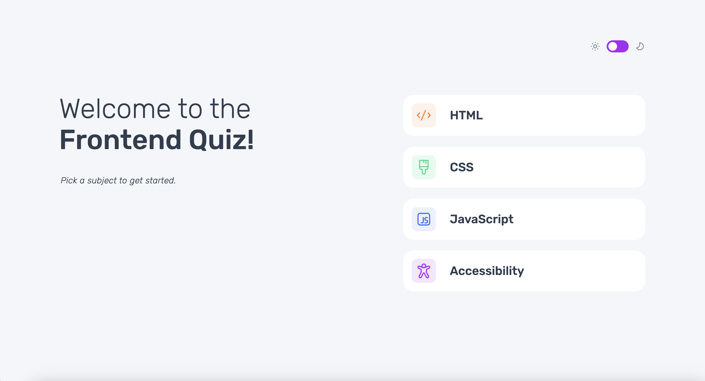

# Frontend Mentor - Frontend quiz app solution

This is a solution to the [Frontend quiz app challenge on Frontend Mentor](https://www.frontendmentor.io/challenges/frontend-quiz-app-BE7xkzXQnU). Frontend Mentor challenges help you improve your coding skills by building realistic projects.

## Table of contents

- [The challenge](#the-challenge)
- [Screenshot](#screenshot)
- [Links](#links)
- [Built with](#built-with)
- [What I learned](#what-i-learned)

## Overview

### The challenge

Users should be able to:

- View the optimal layout for the site depending on their device's screen size

### Screenshot

### Links

- Solution URL: [https://github.com/tunaerten/frontEnd-quiz-app]
- Live Site URL: [https://frontend-quiz-app-erten.netlify.app]

## My process

### Built with

- Semantic HTML5 markup
- CSS custom properties
- Flexbox
- CSS Grid
- Mobile-first workflow
- JavaScript

### What I learned

This project turned out to be quite challenging. Unfortunately, limited time made it a lengthy process to complete. Each time I took a break, resuming with a fresh understanding of the code proved difficult. JavaScript presented its own set of hurdles, and the responsive design across different devices was especially complex. I’ve decided that in future projects, I’ll start with a detailed sketch. While I began with mobile and moved up to tablet and desktop, I faced unique challenges at each breakpoint, often requiring code adjustments. I also learned that separating media queries into a dedicated file made reading and updating the code much easier. On multiple occasions, I accidentally altered my original code, causing issues. Overall, it was a long marathon for me, but I’m pleased with the result.
